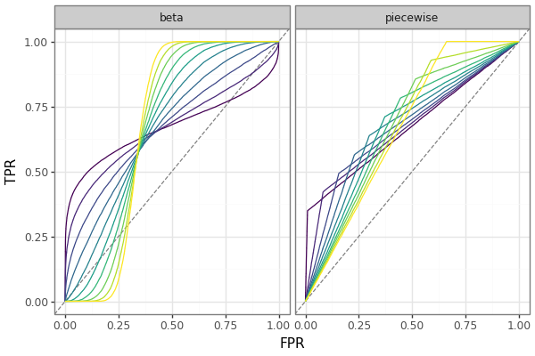

## `roctet`



[!TIP]
Looking for a quickstart? Check out the [demo notebook](docs/demo.ipynb)

The famous [Anscombe's Quartet](https://en.wikipedia.org/wiki/Anscombe%27s_quartet) dataset (and its modern cousin, the [Datasaurus Dozen](https://en.wikipedia.org/wiki/Datasaurus_dozen)) features different datasets with shared summary statistics and regression lines. 
It serves as a cautionary illustration of the importance of EDA. 

`roctet` provides the similar ability to generate numerous datasets consisting of a predictive score and binary target which all have the same AUROC but vary substantially in ROC curve shapes, precision, recall, and other model evaluation metrics. 

Returned datasets may be useful for teaching purposes or testing the relationship between different model evaluation metrics. 

### Methodology

`roctet` creates ROC curves with a fixed AUC using either of two parameterization: Beta or Piecewise. 

After creating an ROC curve, the same methodology is used to map back from the ROC scores to simulated prediction / target pairs. 

#### Beta

The ROC curve is simulated with the CDF of the `Beta(a,b)` distribution. While there is no theoretical link between Beta distributions and AUROC, the Beta CDF has many convenient properties for simulating AUROC:

- it is continuous, monotonic, and concave
- has a domain and range between 0 and 1
- has a closed-form AUC characterized solely by the ratio of parameters `r = b/a`
- can deliver a range of shapes controlled with `b+a`

For a given AUROC and control (`b+a`), `roctet` solves for the parameters of the Beta distribution and treats the resulting CDF as the ROC curve. This creates a slightly atypical ROC shape at the extremes, but is sufficient for a toy example.

#### Piecewise Linear

The ROC curve is simulated as a piecewise linear function with a single inflection point at `(x,y)`. That is, the ROC curve is defined by:

- `tpr = (y/x) * fpr` for `fpr < x`
- `tpr = y + ((y-tpr)/(x-fpr)) * (fpr - x)` for `fpr >= x`

This creates an ROC curve with an atypical "sharp bend" but, once again, is sufficient for a toy example. 

#### Score Derivation

Given a ROC curve, curves are derive in three steps:

- Simulate a set of `(fpr,tpr)` points on the ROC curve
- Calculate the implied number of True Positives and True Negatives in each score "band" 
- Randomly generate scores and assign target values within each bin

Precision of matching AUCs is controlled by the sample size and number of bins used.

### Usage

To get started, jump in to generate some datasets: 

```python
from roctet import calc_roctet

dfs = calc_roctet(auroc = 0.67, n_sets = 10)
dfs[0].glimpse()
```

## Installation

Install from GitHub:

```bash
python -m pip install "git+https://github.com/emilyriederer/roctet.git"
```

Install a specific release tag:

```bash
python -m pip install "git+https://github.com/emilyriederer/roctet.git@v0.1.0"
```

Developer / editable install:

```bash
git clone https://github.com/emilyriederer/roctet.git
cd roctet
uv sync
uv pip install -e .
```
